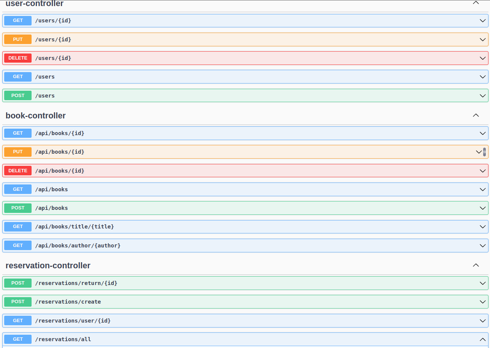

# biblioteca-online
Projeto para digitalizar biblioteca municipal com a finalidade de melhorar a experiencia dos leitores de patrocinio e estimular a leitura.

## Descrição

  Idéia deste protejo é possibilitar a melhora do acesso aos livros disponíveis na biblioteca municipal aos cidadãos do município. Por meio de consultas de disponibilidade e reservas online, a população poderia, de casa, garantir sua leitura da semana. 

## O projeto possui integração com swagger para consumo devido de seus Endpoints.

URL do documento Swagger: http://localhost:8080/swagger-ui/index.html

## UML do Projeto

